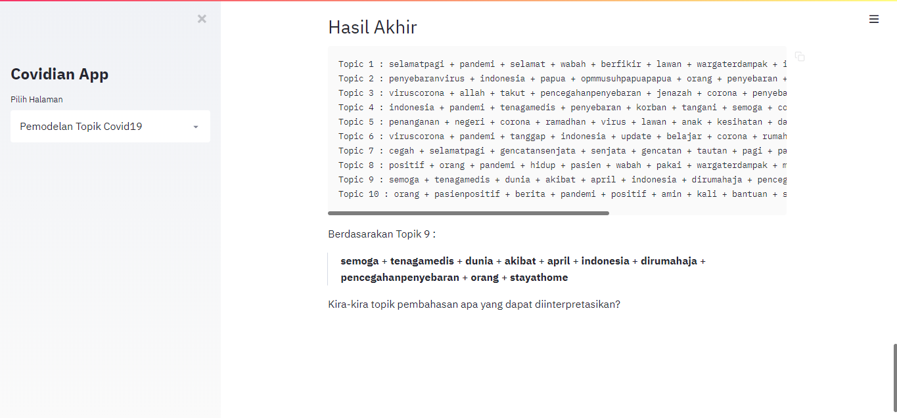
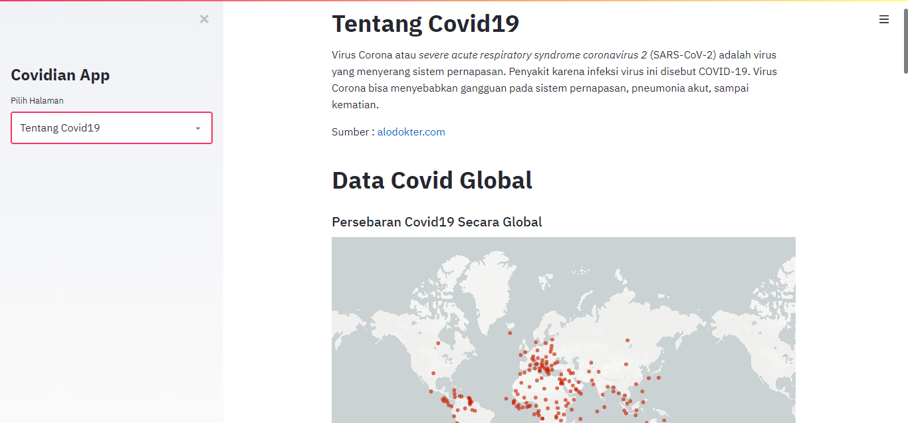
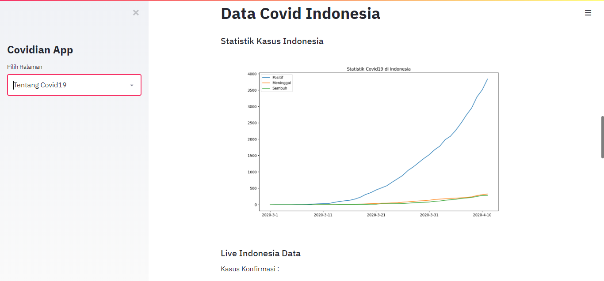

# Covidian App

This application was created as a concern for the Covid19 pandemic which is currently sweeping the world with an analytical data approach.

By creating tools for analyzing data on Twitter so we can help us find out what topics are being discussed in data related to covid19, the analysis includes Wordcount and Topic Modeling with the Latent Dirchlect Allocation (LDA) algorithm.

This application is also equipped with various information about Covid19 both globally and regionally. [Demo](https://covidian-app.herokuapp.com/)

## Preview








## Instaling Setup
Following this step to run the app :

- Clone this repo
- Create a virtual environment inside the folder
- Installing all requirements library using this command 
  ```
  pip install -r requirements.txt
  ```
- And App is ready to running, hit this command
  ```
  streamlit run src/app.py
  ```

## Data Apis
Source of APIs used in this application :

- [kawalcorona.com](https://kawalcorona.com/api/)
- [Pomber](https://github.com/pomber/covid19)

## Libraries
Some of the main libraries that are used in this application :

- [Twint](https://github.com/twintproject/twint)
- [Streamlit](https://streamlit.io/)